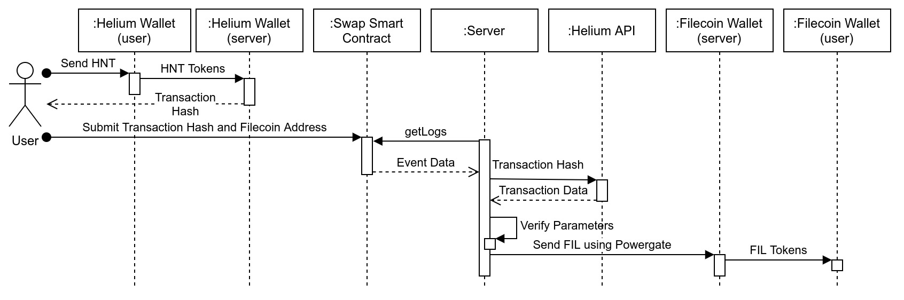
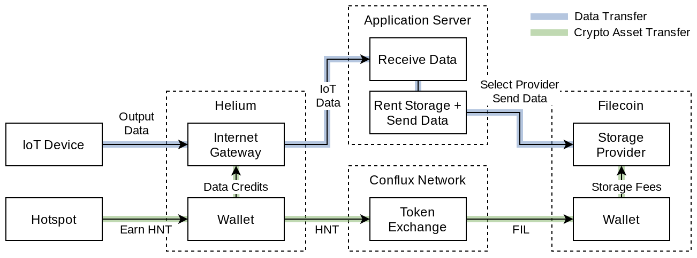

# HNT to FIL Conversion Using Conflux Network
A simple demonstration of connecting [Helium Network](https://www.helium.com/) and [Filecoin](https://filecoin.io/) (using [Powergate](https://docs.textile.io/powergate/)) that has the potential to facilitate IoT and decentralized storage connectivity. The token conversion is handled by a server that monitor a [Conflux Network](https://confluxnetwork.org/) smart contract that handles basic record keeping.

## Components
[Conflux Network](https://developer.conflux-chain.org/) + [Javascript SDK](https://www.npmjs.com/package/js-conflux-sdk)  
Filecoin [Powergate](https://docs.textile.io/powergate/) + [Javascript SDK](https://github.com/textileio/js-powergate-client)   
[Helium Wallet CLI](https://developer.helium.com/blockchain/blockchain-cli)


_Sequence diagram illustrating the communication between various components in order for HNT tokens to be converted to FIL tokens_

## Setup Steps
1. Setup [Powergate](https://docs.textile.io/powergate/) and start the [localnet](https://docs.textile.io/powergate/localnet/) using:
```
cd powergate/docker
make localnet
```
Note that `localnet` means it is only operating in a test environment. For deployment, Powergate can be setup to connect with the [Filecoin testnet](https://docs.textile.io/powergate/testnet/).

1. Setup the [Helium CLI](https://developer.helium.com/blockchain/blockchain-cli) and obtain a wallet using:
```
./target/release/helium-wallet create basic
```
1. Optional: Deploy the smart contract on Conflux Network using the `contract/deploy.js` file. To do this, the `contract` folder must have a `.env` file with:
```
PRIVATE_KEY=<insert a Conflux private key>
```
1. Start the `server/index.js` file to being monitoring the Conflux Network smart contract. Make sure the configuration is properly set in the file. Default configuration:
```js
const walletHNT = "13bmmTR2wVqYoj7E85dXgA8cVSbYP2bWD7YhBDNf9N2vm9DpQPf"; //HNT wallet address
const cfxContract = "0x8975f507a3d577aefbfefc929c9891b529fb1398"; //contract address
```

## Interaction Steps
1. Using the Helium CLI [send HNT](https://developer.helium.com/blockchain/blockchain-cli#sending-tokens) to the `walletHNT` address.
```
./target/release/helium-wallet  pay --commit --payee 13bmmTR2wVqYoj7E85dXgA8cVSbYP2bWD7YhBDNf9N2vm9DpQPf=0.1
```
One the transaction is submitted, the transaction hash will be visible in the command line. Use the transaction hash to track the status on the [Helium Blockchain Explorer](https://explorer.helium.com/).

1. Once the transaction has been confirmed on the explorer, use the `deploy.js` file in the `contract` folder to submit transaction hash and corresponding Filecoin wallet address. Change these lines at the top:
```js
const HNT_TRANSACTION = "k6fu3SqhF3X-kBaFWDtRxtTixLt1Nelsjlvmaia3z4s";
const FIL_ADDRESS = "t3q5z6nbg4mi4u46snrcznhtilwvxlaafcgpw7exouvvypb3vubltnjurg7jnm6frzwwsogjcmddyb3wd4u4qq";
```
1. When the transaction is submitted, the server will see the event from the smart contract. Verify the HNT transaction was sent to the correct wallet, and release FIL to the corresponding address.

## Details
The smart contract - [`contract/swap.sol`](./contract/swap.sol) - contains two functions. `setRate` is for setting the conversion rate that the server uses to convert from HNT to FIL. `FIL2HIL` emits an event containing the Helium transaction hash, the Filecoin address, and the rate. These parameters are picked up by the server for processing. Additionally, the smart contract tracks which transaction hashes have previously been submitted to prevent double-spending.

The server - [`server/index.js`](./server/index.js) - has five main functions. `main` is the function that is called that contains all the other functions. `setupLoop` sets up the necessary tokens to connect to a Powergate instance, and will loop to try again if a token is incorrect. `cfxCheck` is used to monitor the Conflux Network smart contract for any new events. `hntCheck` is used to verify the transaction on Helium and get the amounts from the transaction. `amtCalc` uses the rate from the emitted event to calculate the amount of FIL tokens to send. `sendFIL` will communicate with Powergate to send FIL tokens to the specified address.

## Improvements
This demonstration is only the initial steps and could be improved in many ways to make it ready for deployment.


_Conceptual implementation of fully functioning application connecting IoT devices through Helium to storage provided by Filecoin_

#### HTLC on Helium
Helium has the capability to perform [hashed timelock (HTLC) transactions](https://developer.helium.com/blockchain/blockchain-primitives). By using HTLC functionality, user transactions can be made even more secure. HTLC requires the submission of an extra "key" to unlock a transaction, otherwise the transaction reverts. This key can be setup in a Helium transaction and verified through the Conflux smart contract and prevent attackers from stealing someone else's transaction.

#### More thorough integration of Powergate/Filecoin
Currently, the only Powergate function used is the ability to send tokens. In the future, it may be possible to track token transaction hashes and make the token transfer work in both directions, rather from HNT to FIL only.

#### Convert server to use an Oracle network
A more robust way to connect across three networks would be the use of oracle networks to securely pass information. Multiple nodes in the oracle networks could be required to confirm transaction activity in order to prevent any attackers from submitting transactions. Additionally, the `rate` in the smart contract can be connected to price feeds from oracle networks.

#### Wrap HNT and FIL on Conflux for even more capability
The demonstration simply converts from one token to another. However, using an ERC-20 standard, HNT and FIL could be wrapped on Conflux as cHNT and cFIL. This would make them tradeable to other Conflux Network assets as well and open up even more opportunity to use HNT and FIL.

#### Implement the file storage application side, not just token conversion
In addition to token swaps, there needs to be a way for IoT devices (and their respective infrastructure) to purchase storage and save data on Filecoin. That would be another step towards complete automation of decentralized internet and storage for IoT.

## Resources
Filecoin Docs
- https://docs.filecoin.io/build/start-building/interacting-with-the-network

PowerGate
- https://docs.textile.io/powergate/
- https://docs.textile.io/powergate/localnet/
- https://docs.textile.io/powergate/cli/pow/
- https://textileio.github.io/js-powergate-client/

Helium Network Endpoint
- https://developer.helium.com/blockchain/api
- https://explorer.helium.com
- https://developer.helium.com/blockchain/blockchain-cli
